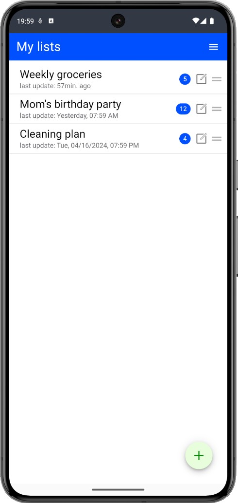
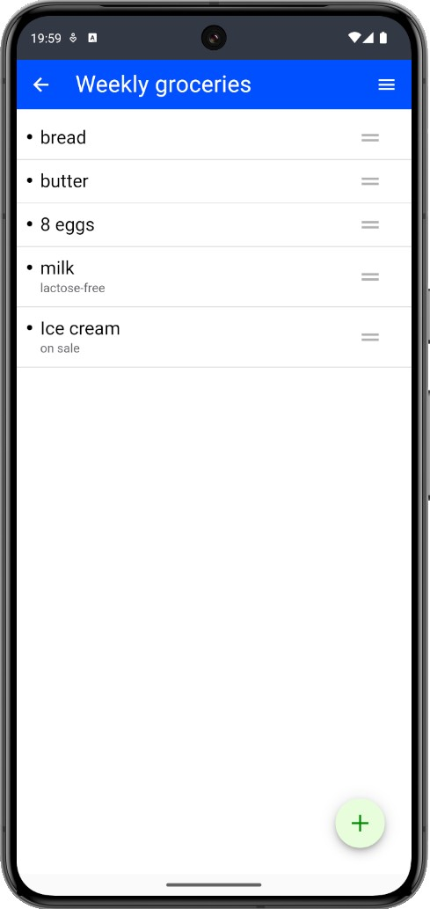
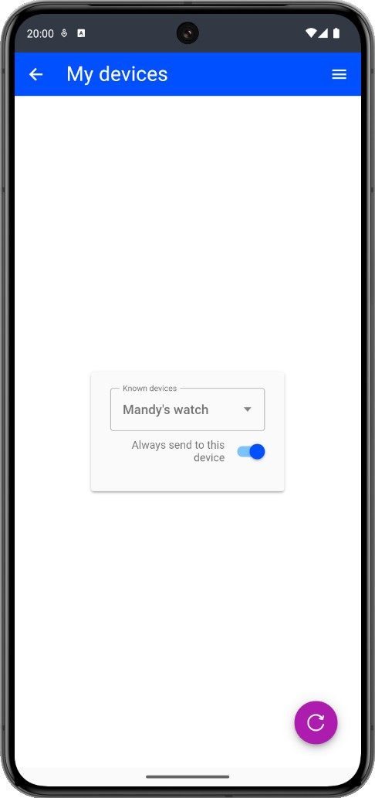
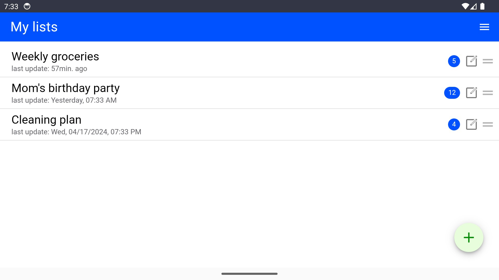
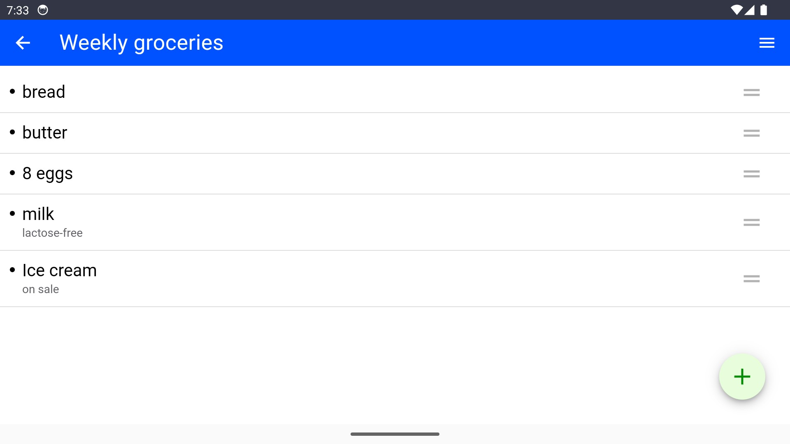
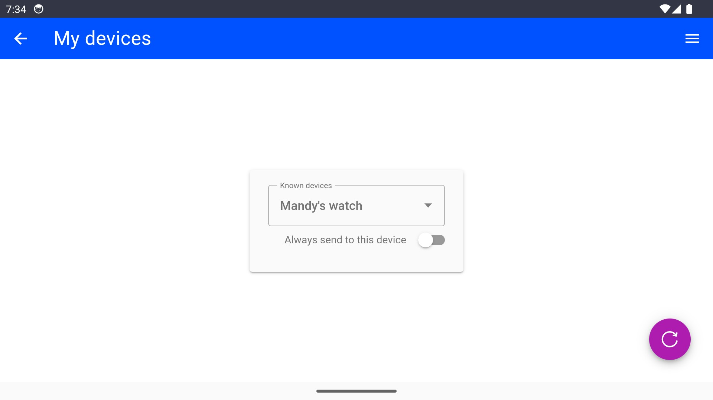

  
This is my companion app for the <a href="https://github.com/RomanDrechsel/garmin-list-iq" target="_blank">Lists-App</a> for Garmin watches.
  

### Assets
**Icons**:  
All icons are self-made.  

### Description
You are able to manage todo- and shopping-lists on your smartphone and transmit them easily to your Garmin watch.  

This app is only available for Android in Google Playstore. 
It supports english and german language.  

### Screenshots

 

  
If you like this app, you can support me at  
[Paypal](https://paypal.me/RomanDrechsel) or [Buy me a coffee](https://www.buymeacoffee.com/romandrechsel)
